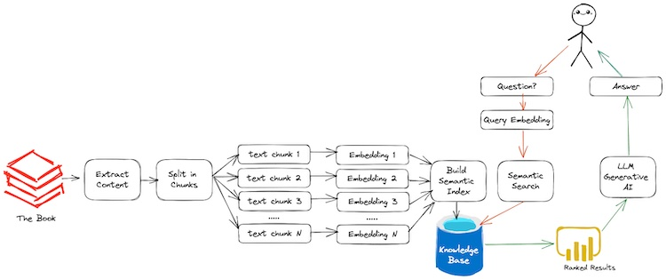

# langchain-chatpdf


Reading a book can be a fulfilling experience, transporting you to new worlds, introducing you to new characters, and exposing you to new concepts and ideas. However, once you’ve finished reading, you might find yourself with a lot of questions that you’d like to discuss. Perhaps you don’t have anyone nearby who has read the book or is interested in discussing it, or maybe you simply want to explore the book on your own terms. In this situation, you might be left wondering how long it will take to fully digest the book and answer your own questions. Without a tutor or friends around to provide guidance and discussion, you may need to take a more thoughtful and introspective approach to your reading.

Imagine that we are having a non-judgmental AI tutor to assist in the question and answer process can be incredibly helpful, especially when it comes to exploring and applying the ideas presented in a book. An AI can provide unbiased and objective insights into the book’s themes and concepts, and help you to understand the author’s perspective on the subject matter. With an AI’s assistance, you can ask deeper and more meaningful questions, and receive thoughtful and informative responses that can help you to connect the ideas in the book to your own experiences and beliefs. This can lead to a more enriching before and after the reading experience.

In this repository, we take the practical approach of building a question and answering system using [OpenAI](https://openai.com/), [LangChain](https://langchain.readthedocs.io/en/latest/), and [FAISS](https://github.com/facebookresearch/faiss) - a library for efficient similarity search and clustering of dense vectors. The book is broken down into smaller documents, and OpenAI embeddings are used to convert them into vectors, which are then stored externally using FAISS.



Here is the general workflow for our application:

1. Extract the Book Content
2. Split Book into Smaller Chunks
3. Build Semantic Index
4. Ask a Book Questions

## Development

### Install libraries

```bash
pip install -r requirements.txt
```

#### Install FAISS (Facebook AI Similarity Search)

**GPU**:

```bash
pip install faiss
```

**CPU**:

```bash
pip install faiss-cpu
```

## Run the application

**With streamlit**:

```bash
streamlit run app.py
```

**With gradio**:

```bash
pip install -r gr-requirements.txt
gradio run gr-app.py
```
